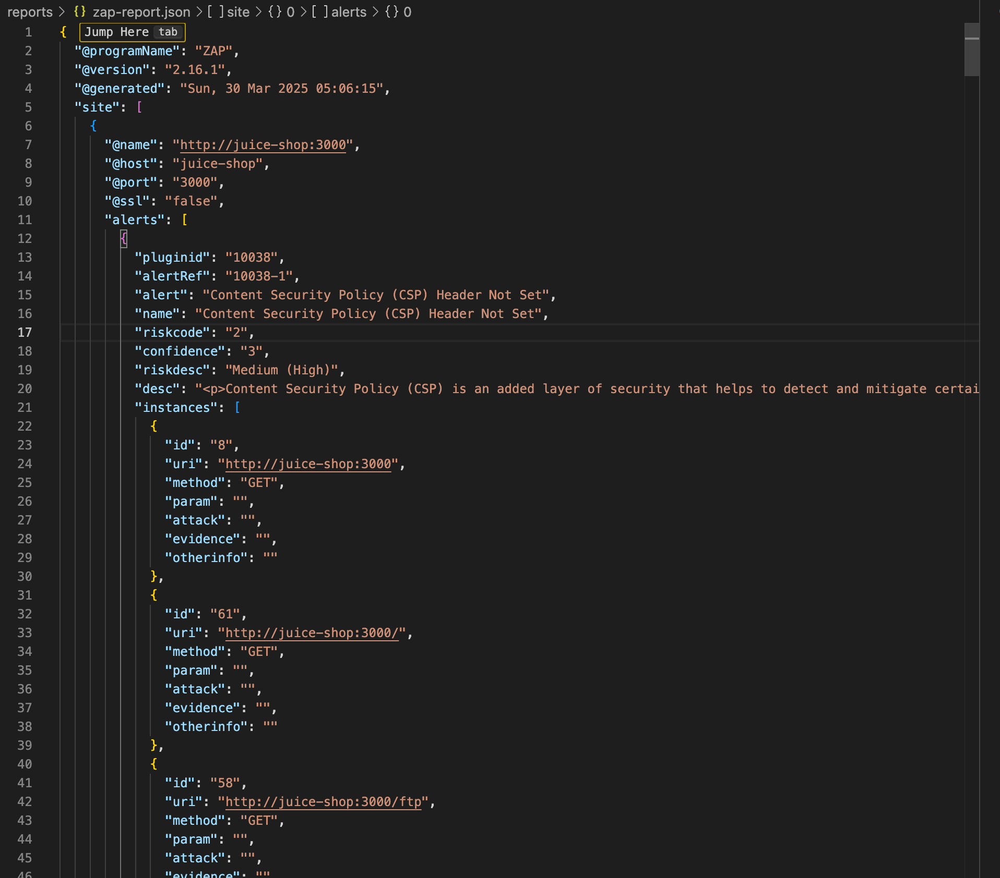

Hi

Here is the result structure

reports/

- zap-report.json (DAST Result)
- gitleaks-report.json (Secret Scanning)
- npm-audit.json (SCA result)
- npm-sbom.cdx.json (SBOM cyclonedx)
- semgrep-results.sarif (SAST)

- trivy-compliance.json (complliance scan)
- trivy-dockerfile.json (dockerfile scan)
- trivy-vulns.jon (container scan)

---

# DAST

# Secret Scanning

# Software Composition Analysis (SCA)

# Software Bill of Materials (SBOM)

# Static Application Security Testing (SAST)

# Container Security

can check the file directly

# Defect Dojo

